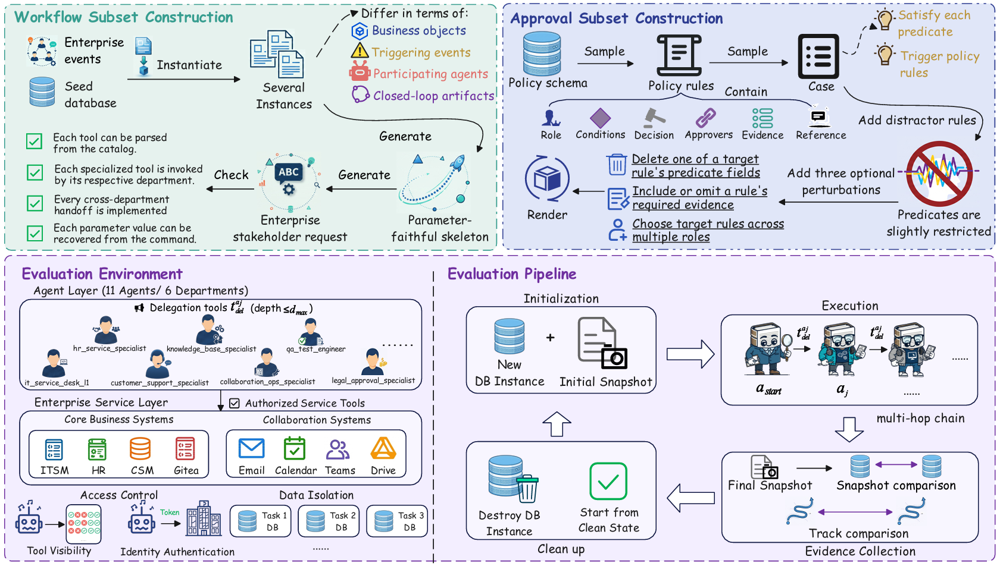

# EntCollabBench



EntCollabBench is a benchmark for enterprise collaborative agent systems. It is designed to evaluate how multiple agents coordinate across realistic enterprise workflows, tools, and approval processes, covering scenarios such as MCP-based task execution, multi-agent collaboration, and approval-oriented decision making.

This README provides a quick start guide for bringing up the Arena services, agent services, and benchmark pipeline on a single machine.

## Quick Start

### 1. Requirements

- Linux
- Docker + Docker Compose
- Conda
- Python 3.11

Before starting, make sure the following commands are available:

```bash
docker --version
docker compose version
conda --version
python3 --version
```

### 2. Get the Code

If the repository has not been cloned yet:

```bash
git clone ...
```


### 3. Start Arena MCP Services

Start the Arena-side containers first:

NOTE: This repository uses Docker images from the public project to set up the mcp environment.

```bash
docker compose -f Arena/docker-compose-mcp.yml up -d --force-recreate
```


### 4. Build and Start Agent Services

#### 4.1 Agent-side Variables


```bash
# export HTTP_PROXY=http://host.docker.internal:<your port>
# export HTTPS_PROXY=http://host.docker.internal:<your port>
# export http_proxy=http://host.docker.internal:<your port>
# export https_proxy=http://host.docker.internal:<your port>
export NO_PROXY=localhost,127.0.0.1,host.docker.internal,redis,agent-it-service-desk-l1,agent-hr-service-specialist,agent-it-change-engineer,agent-customer-support-specialist,agent-knowledge-base-specialist,agent-collaboration-ops-specialist,agent-developer-engineer,agent-qa-test-engineer,agent-finance-approval-specialist,agent-legal-approval-specialist,agent-procurement-approval-specialist
export no_proxy=localhost,127.0.0.1,host.docker.internal,redis,agent-it-service-desk-l1,agent-hr-service-specialist,agent-it-change-engineer,agent-customer-support-specialist,agent-knowledge-base-specialist,agent-collaboration-ops-specialist,agent-developer-engineer,agent-qa-test-engineer,agent-finance-approval-specialist,agent-legal-approval-specialist,agent-procurement-approval-specialist

export OPENAI_API_KEY=your_model_service_api_key
export OPENAI_BASE_URL=https://openrouter.ai/api/v1
export AGENT_LLM_MODEL=anthropic/claude-sonnet-4.6
export AGENT_SUMMARY_MODEL=anthropic/claude-sonnet-4.6
export TASK_TIMEOUT_SECONDS=1000
export AGENT_HTTP_TIMEOUT_SECONDS=400
```

Notes:

- `OPENAI_API_KEY` is required. `docker compose` will fail immediately if it is missing.
- `OPENAI_BASE_URL` can be replaced with any OpenAI-compatible API endpoint.
- `AGENT_LLM_MODEL` and `AGENT_SUMMARY_MODEL` are required.
- If your Docker containers do not need an outbound proxy, you can omit `HTTP_PROXY` and `HTTPS_PROXY`.
- Keeping `NO_PROXY` is recommended so service-to-service traffic inside Docker does not go through the proxy.

Optional: you can also modify the environment variables in `agent/.env` to tune agent runtime behavior. This file is useful for non-secret defaults such as summary behavior, MCP schema settings, and workspace read limits.

Current examples in `agent/.env` include:

```bash
AGENT_HTTP_TIMEOUT_SECONDS=120
AGENT_SUMMARY_ENABLED=1
AGENT_SUMMARY_TRIGGER_TOKENS=50000
AGENT_SUMMARY_TRIGGER_MESSAGES=99
AGENT_SUMMARY_KEEP_MESSAGES=99
MCP_SCHEMA_CONTEXT_MODE=full
MCP_SCHEMA_MEMORY_REDACTION_MODE=placeholder
AGENT_WORKSPACE_READ_MAX_CHARS=300000
AGENT_WORKSPACE_READ_MAX_BYTES=8388608
AGENT_WORKSPACE_READ_PDF_MAX_PAGES=20
```

These settings are optional. The required API and model variables should still be provided through exported shell variables or another environment-loading mechanism before running Docker Compose.

#### 4.2 Build Images

```bash
docker compose -f agent/docker-compose.yml build
```

#### 4.3 Start Services


```bash
docker compose -f agent/docker-compose.yml up -d --force-recreate
```


### 5. Create the Python Benchmark Environment

```bash
conda create -n EntCollabbench python=3.11
conda activate EntCollabbench
pip install -r requirements.txt
```

If `pip` requires a proxy in your environment, keep the proxy variables before installing dependencies. Otherwise, unset them first.

### 6. Run the Benchmark

#### 6.1 Built-in Seed SQL Files

Before starting Arena services, the seed SQL files for initializing the business data are built into this repository.

These SQL files are used to populate the Arena MCP services with the required initial business records, such as email, drive, HR, ITSM, Teams, and Gitea seed data.

They are placed in the corresponding `Arena/seed/*/dbs/` directories in this repository so that the Arena containers can load them during startup.

If your local checkout already contains the required seed SQL files, you can skip this step.

#### 6.2 Built-in Datasets

The datasets are built into this repository. Includes these task files:

- `scripts/dataset/mcp_tasks_160.json`
- `scripts/dataset/mcp_multi_tasks_40.json`
- `scripts/dataset/approval_tasks_80.json`
- `scripts/dataset/approval_multi_task_20.json`

#### 6.3 Built-in Approval Docs

The repository includes approval reference documents under `local_data/`. These are mounted into the corresponding approval agent workspaces when the agent services start.

Available approval document sets:

- `local_data/finance_approval_specialist/rulebook.md`
- `local_data/finance_approval_specialist/policy_docs/`
- `local_data/legal_approval_specialist/rulebook.md`
- `local_data/legal_approval_specialist/policy_docs/`
- `local_data/procurement_approval_specialist/rulebook.md`
- `local_data/procurement_approval_specialist/policy_docs/`

Representative documents include:

- Finance: `expenses.md`, `vendors_payments.md`, `asset_management.md`, `headcount_payroll.md`
- Legal: `privacy.md`, `nda_contracts.md`, `intellectual_property.md`, `trade_export.md`
- Procurement: `purchase_orders.md`, `vendor_management.md`, `software.md`, `security_privacy.md`

#### 6.4 Benchmark Judge Variables

After execution, the benchmark uses one or more judge models for scoring. `scripts/benchmark.py` expects the following variables to be set in at least one valid combination:

```bash
unset HTTP_PROXY HTTPS_PROXY ALL_PROXY http_proxy https_proxy all_proxy

# export HTTP_PROXY=http://..
# export HTTPS_PROXY=http://..
# export http_proxy=http://..
# export https_proxy=http://..

export JUDGE_OPENAI_API_KEY=your_judge_api_key
export JUDGE_OPENAI_BASE_URL=https://openrouter.ai/api/v1
export JUDGE_MODELS=google/gemini-3.1-pro-preview
export JUDGE_TIMEOUT_SECONDS=500
```

Notes:

- `JUDGE_MODELS` is required and supports 1 to 3 comma-separated models.
- If `JUDGE_OPENAI_API_KEY` is not set, the program falls back to `OPENAI_API_KEY`.
- If `JUDGE_OPENAI_BASE_URL` is not set, the program falls back to `OPENAI_BASE_URL`.
- The `unset` step before re-exporting proxy variables helps avoid inheriting an unsuitable proxy configuration. Adjust it to match your own network environment.

#### 6.5 Foreground Run Example

```bash
python scripts/benchmark.py \
  --tasks-spec-file scripts/dataset/mcp_tasks_160.json \
  --trajectory-full-mode \
  --batch-concurrency 16 \
  --bench-result-jsonl scripts/result/result.jsonl \
  --trajectory-run-jsonl scripts/result/traj/traj.jsonl \
  --continue-on-error
```

Argument summary:

- `--tasks-spec-file`: task file in JSON or JSONL format.
- `--trajectory-full-mode`: enable full trajectory output.
- `--batch-concurrency`: number of task batches to run in parallel.
- `--bench-result-jsonl`: one result summary line per task.
- `--trajectory-run-jsonl`: output file for full runtime trajectories.
- `--continue-on-error`: continue the batch even if an individual task fails.

## Citation

If you use EntCollabBench in your research, please cite:

[]()
